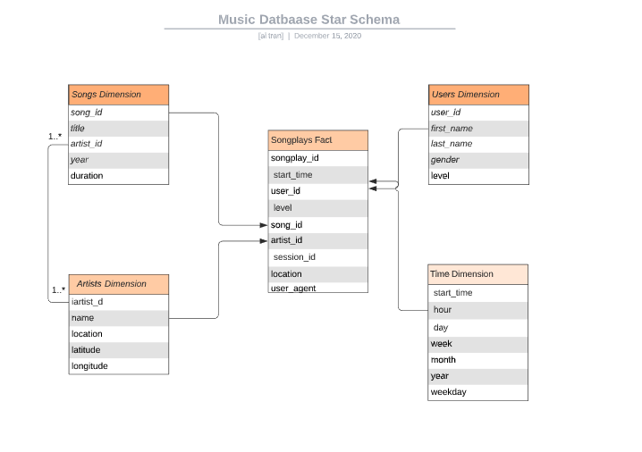

# Sparkify AWS Data Warehouse for Song Play Analysis

This repo contains python modules and utility shell scripts that automate the 
ETL workflow pipeline for transfering music song and log datasets from json 
files into a PostgreSQL database for song play analysis.

The json data files come in two datasets:

### Song Dataset
The song dataset is a subset of real data from the [Million Song Dataset](http://millionsongdataset.com/). 
Each file is in JSON format and contains metadata about a song and the artist 
of that song. The files are partitioned by the first three letters of each song's 
track ID. For example, here are filepaths to two files in this dataset.

```
song_data/A/B/C/TRABCEI128F424C983.json
song_data/A/A/B/TRAABJL12903CDCF1A.json
```
And below is an example of what a single song file, TRAABJL12903CDCF1A.json, looks like.

```
{"num_songs": 1, "artist_id": "ARJIE2Y1187B994AB7", "artist_latitude": null, "artist_longitude": null, "artist_location": "", "artist_name": "Line Renaud", "song_id": "SOUPIRU12A6D4FA1E1", "title": "Der Kleine Dompfaff", "duration": 152.92036, "year": 0}
```

### Log Dataset
The second database consists of log files in JSON format generated by this 
[event simulator](https://github.com/Interana/eventsim) based on the songs 
in the dataset above. These simulate activity logs from a music streaming app 
based on specified configurations.

The log files in the dataset are partitioned by year and month. For example, 
here are filepaths to two files in this dataset.

```
log_data/2018/11/2018-11-12-events.json
log_data/2018/11/2018-11-13-events.json
```

And below is an example of what the data in a log file, 2018-11-12-events.json, looks like.


The ETL python module or the bulk-import script can be used to import the data 
contained in these json files into a Postgresql database, which can be used for queries to analysis song play


## Star Schema for Sparkify AWS Data Warehouse

To facility song play analysis, the music PostgreSQL database based on a star 
schema is created to store the imported song and log data.

The database schema includes the `songplays` fact table and four dimension tables 
that are linked by the primary keys defined in the dimenion tables.

Users' listening sessions data is stored in the `songplays` fact table.  This 
table only contains the primary key for the song, artist, user, and timestamp 
in each entry.  Metadata such as song title or artist's or user's name, etc. 
can be queried by joining the fact table with the respective dimension tables 
using these primary keys.



Below is brief description of the fact and dimentions tables of the star 
schema created that is optimized for queries on song play analysis.

### Fact Table
1. songplays - records in log data associated with song plays.  This table 
contains the session information, with referential key for specific user, 
song played, and the song's artist linked to the `users`, `songs`, `artists`, 
and `time` tables, respectively.

### Dimension Tables
1. users - users captured from log dataset
2. songs - songs in music database
3. artists - artists in music database
5. time - timestamps of records in `songplays` broken down into specific units

Each dimension table has a primary key which is used to join with the 
`songplays` fact table for getting more detail information about the 
song(s), the artist(s), the user(s), and/or relevant time related to 
the listening session.

## ETL Pipeline Workflow

The data warehouse uses the AWS Redshift columnar database to 
store event logs data extracted from the user listening sessions and songs information
to support user listening analysis.

The process begins first with loading data from `log_data` and `song_data` json files in an AWS S3 bucket
into the `staging_events` and `staging_songs` tables, respectively.

Then, ETL module extracts data from these staging tables into the `songplays` fact table and `users`,
`artists`, `songs`, and `time` dimension tables.

The fact table can be joined with the dimension tables to analyze the users' listening sessions.

Launching a new cluster uses the infrastructure-as-code `create_table.py`
module to create a new cluster in AWS with provided configurations
provided in the `dwh.cfg` file.

Once the cluster is up and running, the song-analytics star schema
can be generated by running the `--command create` option of
the `create_tables.py` module.

This command option drops all existing tables in the schema
and recreate the staging tables as well as the facts and
dimension tables.

Checking current status of the cluster can be done easier by issuing
the `--command status` option.

Use the `--command delete` option to clean up all AWS resources after work is done,

The `etl.py` module loads logs and songs data currently stored in a S3 bucket 
into the `staging_events` and `staging_songs` tables.  It also perform ETL
process to then load data into following fact and dimensions tables:
* `songplays` fact
* `users` dimension
* `songs` dimension
* `artists` dimension
* `time` dimension

## CLI Operations

**Before issuing the `make run` to perform the entire ETL process, create a `dwh.cfg` from the sample configuration file, 
`sample-dwh.cfg` and fill in the relevant settings.**

Below is the summary of all operations to launch the data warehose in AWS and 
relevant ETL commands to populate the tables in it.

To kick off the entire ETL process with virtual environment already
created and activated.
```
$ make run
```
or to first activate the virtual environment and run ETL 
```
$ make arun
```

To clean up the cluster and virtual environment:
```
$ make clean
```

To launch a new cluster:
```
$ make launch-cluster 
```

To delete an existing cluster:
```
$ make remove
```

To create the database schema with all tables:
```
$ make create-dwh
```

To check current status of the cluster:
```
$ make check-cluster-status
```


## Sample Queries

Here are some of queries that you can run to view the import data.

General data about the data warehouse:
```
$ ︎make verify
python verify.py
01.23.2021 16:25:04 PM [INFO] Data warehouse cluster info: host=song-analytics-cluster dbname=sparkify user=prophet password=*** port=5439
01.23.2021 16:25:04 PM [INFO] Init AWS Client and Resource instances
01.23.2021 16:25:04 PM [INFO] Fetching AWS IAM role for loading data to data warehouse
01.23.2021 16:25:05 PM [INFO]                  Key                                                                                              Value
0  ClusterIdentifier                                                                             song-analytics-cluster
1           NodeType                                                                                          dc2.large
2      ClusterStatus                                                                                          available
3     MasterUsername                                                                                            prophet
4             DBName                                                                                           sparkify
5           Endpoint  {'Address': 'song-analytics-cluster.c5c7ovgg2wrr.us-west-2.redshift.amazonaws.com', 'Port': 5439}
6              VpcId                                                                                       vpc-d6ac6fae
7      NumberOfNodes                                                                                                  4
01.23.2021 16:25:05 PM [INFO] Connecting to sparkify at song-analytics-cluster.c5c7ovgg2wrr.us-west-2.redshift.amazonaws.com, and get cursor to it
01.23.2021 16:25:06 PM [INFO] Verify data warehouse fact and dimention tables are populated properly
01.23.2021 16:25:06 PM [INFO] Table staging_events: 8056 rows.
01.23.2021 16:25:06 PM [INFO] Table staging_songs: 14896 rows.
01.23.2021 16:25:06 PM [INFO] Table users: 104 rows.
01.23.2021 16:25:06 PM [INFO] Table time: 6820 rows.
01.23.2021 16:25:06 PM [INFO] Table artists: 10014 rows.
01.23.2021 16:25:06 PM [INFO] Table songs: 14896 rows.
01.23.2021 16:25:06 PM [INFO] Table songplays: 7215 rows.
```

Examine the number of songs played with free vs paid level per user.
```
select user_id, level, count(*)
from songplays
group by user_id, level
order by user_id;
```
The above query shows users tend to listen to more songs with `paid` level compared to their `free` level, which is expected since there might be a limit of free songs they can listen to.

Average length of songs played:
```
sparkifydb=> select avg(s.duration) from songplays sp left join songs s on sp.song_id = s.song_id group by s.title order by count(*) desc limit 10;
        avg
-------------------

 269.5832214355469
(2 rows)
```

Top 10 popular artist:
```
sparkifydb=> select a.name, count(*) from songplays sp left join artists a on sp.artist_id = a.artist_id group by a.name order by count(*) desc limit 10;
 name  | count
-------+-------
       |  6819
 Elena |     1
(2 rows)
```

Top 10 popular songs:

```
sparkifydb=> select s.title, count(*) from songplays sp left join songs s on sp.song_id = s.song_id group by s.title order by count(*) desc limit 10;
sparkifydb=> select s.title, count(*) from songplays sp left join songs s on sp.song_id = s.song_id group by s.title order by count(*) desc limit 10;
     title      | count
----------------+-------
                |  6819
 Setanta matins |     1
(2 rows)
```


