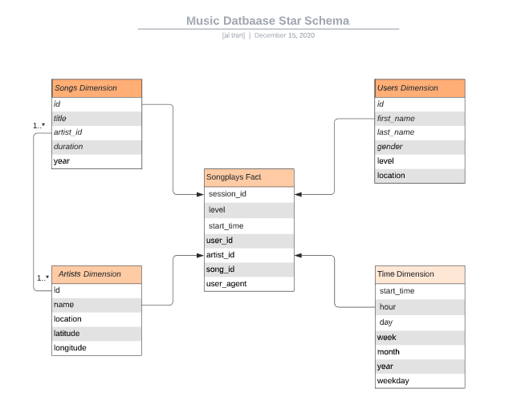

# Music Database for Song Play Analysis


This repo contains python modules and utility shell scripts that automate the ETL workflow pipeline for transfering music song and log datasets from json files into a PostgreSQL database for song play analysis.

The json data files come in two datasets:

### Song Dataset
The song dataset is a subset of real data from the [Million Song Dataset](http://millionsongdataset.com/). Each file is in JSON format and contains metadata about a song and the artist of that song. The files are partitioned by the first three letters of each song's track ID. For example, here are filepaths to two files in this dataset.

```
song_data/A/B/C/TRABCEI128F424C983.json
song_data/A/A/B/TRAABJL12903CDCF1A.json
```
And below is an example of what a single song file, TRAABJL12903CDCF1A.json, looks like.

```
{"num_songs": 1, "artist_id": "ARJIE2Y1187B994AB7", "artist_latitude": null, "artist_longitude": null, "artist_location": "", "artist_name": "Line Renaud", "song_id": "SOUPIRU12A6D4FA1E1", "title": "Der Kleine Dompfaff", "duration": 152.92036, "year": 0}
```

### Log Dataset
The second database consists of log files in JSON format generated by this [event simulator](https://github.com/Interana/eventsim) based on the songs in the dataset above. These simulate activity logs from a music streaming app based on specified configurations.

The log files in the dataset are partitioned by year and month. For example, here are filepaths to two files in this dataset.

```
log_data/2018/11/2018-11-12-events.json
log_data/2018/11/2018-11-13-events.json
```

And below is an example of what the data in a log file, 2018-11-12-events.json, looks like.


The ETL python module or the bulk-import script can be used to import the data contained in these json files into a Postgresql database, which can be used for queries to analysis song play


## Star Schema for Music Database
___
To facility song play analysis, the music PostgreSQL database based on a star schema is created to store the imported song and log data.

The database schema includes the `songplays` fact table and four dimension tables that are linked by the primary keys defined in the dimenion tables.

Users' listening sessions data is stored in the `songplays` fact table.  This table only contains the primary key for the song, artist, user, and timestamp in each entry.  Metadata such as song title or artist's or user's name, etc. can be queried by joining the fact table with the respective dimension tables using these primary keys.



Below is brief description of the fact and dimentions tables of the star schema created that is optimized for queries on song play analysis.

### Fact Table
1. songplays - records in log data associated with song plays.  This table contain the session information, with referential key for specific user, song played, and the song's artist linked to the `users`, `songs`, `artists`, and `time` tables, respectively.

### Dimension Tables
1. users - users captured from log dataset
2. songs - songs in music database
3. artists - artists in music database
5. time - timestamps of records in `songplays` broken down into specific units

Each dimension table has a primary key which is used to join with the `songplays` fact table for getting more detail information about the song(s), the artist(s), the user(s), and/or relevant time related to the listening session.

## ETL Pipeline Workflow
___

The data ETL workflow uses different technique to import the data dependent on the size of the datasets.  Each technique is described below.

### Working with small datasets
A dockerized environment with postgresql database is setup to load music data into an independent  music database with ease.  A Makefile is provided in the `docker` directory that can use to either run individual commands as needed or `make all` to perform the entire ETL pipeline.

This method is suited for importing small datasets into the database. This is due to the fact that the ETL python module is written to traverse the log and song directories and process the json file by file, which can take a few minutes.
Please refer to the `Working with large datasets` section for faster method of importing data using COPY command avaiable in Postgresql.


To run the entire ETL pipeline, at the project root directory `etl-pipeline`, type the followings:

Download this repo to local machine, and go to the `data-modeling`
```
$ git clone https://github.com/nhonaitran/data-engineering.git
$ cd data-engineering/data-modeling
```

then project dir, setup virtual environment, install library dependencies, and off we go:
```
$ cd etl-pipeline
$ python -v venv .venv
$ source .venv/bin/activate
$ pip install -r requirements.txt
$ cd docker
$ make all
```

The make `all` target performs the following tasks:
1. shut down the docker posrgresl (and cassandra) container, and remove it
2. start up a new postgresql container
3. create the student role (with appropriate privileges granted) and default database
4. run the `create_tables` python module to create the tables in the sparkifydb database
5. run the `etl` module with given path where the json files reside
6. run sql scripts to verify data is imported into the table as expected.  

### Working with large datasets
For larger datasets, Postgresql database provides the COPY command that can be used for fast batch importing data into the database.

A couple of shell scripts are provided for kick off the data import and ETL processing with SQL scripts. At the project root directory `etl-pipeline`, type the followings:
```
$ cd etl-pipeline/bin
$ sh bulk-import.sh ../data/log_data log_data
$ sh bulk-import.sh ../data/song_data song_data
$ sh extract_and_verify.sh 
```

The `bulk-import` shell script reads in the content of the json files and invoke the COPY command provided by postgresl to import the json content the given table name

The `extract` shell script then run ETL SQL scripts to extract songs, artists, users and songplays data from the holding table into their own tables as described in above star schema for the database.

## Sample Queries
___
Here are some of queries that you can run to view the import data.

Login to the database:
```
$ psql -h 127.0.0.1 -p 5432 -U student -d sparkifydb
```

General data about the datasets:
```
sparkifydb=> select count(*) from users;
 count
-------
    96
(1 row)

sparkifydb=> select count(*) from artists;
 count
-------
    69
(1 row)

sparkifydb=> select count(*) from songs;
 count
-------
    71
(1 row)

```

Examine the number of songs played with free vs paid level per user.
```
sparkifydb=> select user_id, level, count(*)
from songplays
group by user_id, level
order by user_id;
```
The above query shows users tend to listen to more songs with `paid` level compared to their `free` level, which is expected since there might be a limit of free songs they can listen to.

Average length of songs played:
```
sparkifydb=> select avg(s.duration) from songplays sp left join songs s on sp.song_id = s.id group by s.title order by count(*) desc limit 10;
        avg
-------------------

 269.5832214355469
(2 rows)
```

Top 10 popular artist:
```
sparkifydb=> select a.name, count(*) from songplays sp left join artists a on sp.artist_id = a.id group by a.name order by count(*) desc limit 10;
       name        | count
-------------------+-------
                   |  8035
 Lupe Fiasco       |     5
 Lionel Richie     |     4
 Tom Petty         |     4
 Gob               |     1
 Elena             |     1
 Trafik            |     1
 Jimmy Wakely      |     1
 Sophie B. Hawkins |     1
 Gwen Stefani      |     1
(10 rows)
```

Top 10 popular songs:

```
sparkifydb=> select s.title, count(*) from songplays sp left join songs s on sp.song_id = s.id group by s.title order by count(*) desc limit 10;
     title      | count
----------------+-------
                |  8055
 Setanta matins |     1
(2 rows)
```

