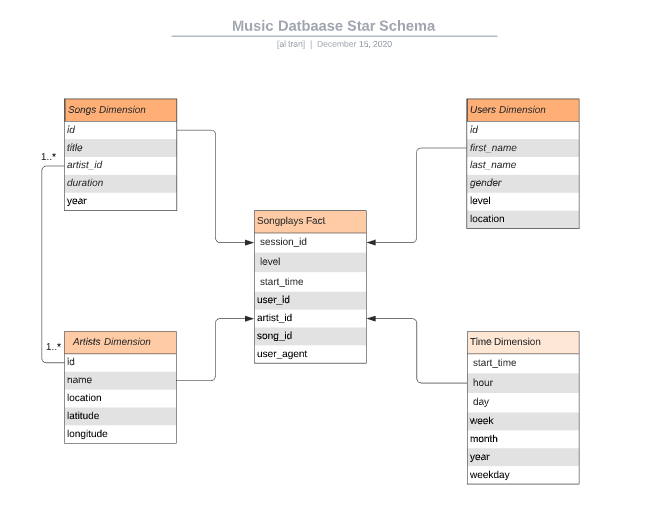

# Music Database for Song Play Analysis

This document describes the ETL pipeline workflow used for transfer musica data from json files into a Postgresql database for song play analysis.

The json data files come in two datasets:

### Song Dataset
The song dataset is a subset of real data from the [Million Song Dataset](http://millionsongdataset.com/). Each file is in JSON format and contains metadata about a song and the artist of that song. The files are partitioned by the first three letters of each song's track ID. For example, here are filepaths to two files in this dataset.

```
song_data/A/B/C/TRABCEI128F424C983.json
song_data/A/A/B/TRAABJL12903CDCF1A.json
```
And below is an example of what a single song file, TRAABJL12903CDCF1A.json, looks like.

```
{"num_songs": 1, "artist_id": "ARJIE2Y1187B994AB7", "artist_latitude": null, "artist_longitude": null, "artist_location": "", "artist_name": "Line Renaud", "song_id": "SOUPIRU12A6D4FA1E1", "title": "Der Kleine Dompfaff", "duration": 152.92036, "year": 0}
```

### Log Dataset
The second database consists of log files in JSON format generated by this [event simulator](https://github.com/Interana/eventsim) based on the songs in the dataset above. These simulate activity logs from a music streaming app based on specified configurations.

The log files in the dataset are partitioned by year and month. For example, here are filepaths to two files in this dataset.

```
log_data/2018/11/2018-11-12-events.json
log_data/2018/11/2018-11-13-events.json
```

And below is an example of what the data in a log file, 2018-11-12-events.json, looks like.


The ETL python module or the bulk-import script can be used to import the data contained in these json files into a Postgresql database, which can be used for queries to analysis song play

## Star Schema for Music Database
___
To facility song play analysis, the music database based on a star schema is created to store the song and log data.  Users' listening sessions data is stored in the `songplays` fact table.  This fact table is supported by four dimensions tables which contains users inforation, songs information, artists information, and the time play for the songs per session.



Below is brief description of the fact and dimentions tables of the star schema created that is optimized for queries on song play analysis.

### Fact Table
1. songplays - records in log data associated with song plays.  This table contain the session information, with referential key for specific user, song played, and the song's artist linked to the `users`, `songs`, `artists`, and `time` tables, respectively.

### Dimension Tables
1. users - users captured from log dataset
2. songs - songs in music database
3. artists - artists in music database
5. time - timestamps of records in `songplays` broken down into specific units

Each dimension table has a primary key which is used to join with the `songplays` fact table for getting more detail information about the song(s), the artist(s), the user(s), and/or relevant time related to the listening session.

## ETL Pipeline Workflow
___
### Working with small datasets
A dockerized environment is setup for individual developers to run an independent postgres musica database with music data loaded.  

A Makefile is provided in this directory that you can use to either run individual commands as needed or `make all` to do everything for you.

The method is suited for import small datasets into the database. This is due to the fact that the ETL pipeline is written to traverse given directory and process json file by file, which can take a few minutes.
Please refer to the `Working with large datasets` section for faster method of importing data using COPY command avaiable in Postgresql.

At the project root directory, type the followings:
```
$ cd docker
$ make all
```

### Working with large datasets
For larger datasets, Postgresql database provides the COPY command that can be used for fast batch importing data into the database.

At the project root directory, type the following:
```
$ cd bin
$ sh bulk-import.sh ../data/log_data log_data
$ sh bulk-import.sh ../data/song_data song_data
$ sh extract.sh 
```
Artists informatiom is stored in the `Artists` table.  This project provides two methods for imthe ETL module that traverse the 
Artists and songs information extracted from the json files in `song_data` directory, where users information and their listening sessions information are extracted to the  By searching for the single entry from log data that show a match of a song from a specific artist
that indicates that the location saved in log data is the area where the user is listening from,
and not the location where the artist is from.

duration field in song_data is the length of the song it self in seconds.

## Sample Queries
___

Average length of songs played:
```
sparkifydb=> select avg(s.duration) from songplays sp left join songs s on sp.song_id = s.id group by s.title order by count(*) desc limit 10;
        avg
-------------------

 269.5832214355469
(2 rows)
```

Top 10 popular artist:
```
sparkifydb=> select a.name, count(*) from songplays sp left join artists a on sp.artist_id = a.id group by a.name order by count(*) desc limit 10;
       name        | count
-------------------+-------
                   |  8035
 Lupe Fiasco       |     5
 Lionel Richie     |     4
 Tom Petty         |     4
 Gob               |     1
 Elena             |     1
 Trafik            |     1
 Jimmy Wakely      |     1
 Sophie B. Hawkins |     1
 Gwen Stefani      |     1
(10 rows)
```

Top 10 popular songs:

```
$ psql -h 127.0.0.1 -U student -d sparkifydb
sparkifydb=> select s.title, count(*) from songplays sp left join songs s on sp.song_id = s.id group by s.title order by count(*) desc limit 10;
     title      | count
----------------+-------
                |  8055
 Setanta matins |     1
(2 rows)
```

