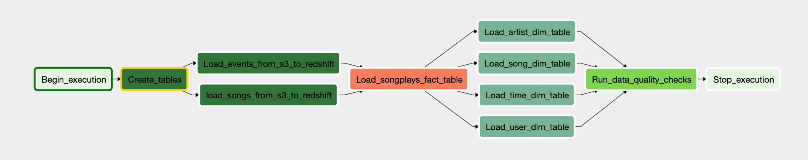

# Sparkify ETL Data Warehouse Pipelines Automation

This repo contains the Apache Airflow DAG and customized plugins for automating Sparkify data warehouse ETL pipelines.  The ETL workflow is setup to run hourly, and saves the final schema in AWS Redshift for user listening analysis

The DAG is designed to perform the following the data warehouse tasks:
* Create the tables in Amazon Redshift cluster
* Extract the songs and events datasets from AWS S3 and copy the data into staging tables in Amazon Redshift cluster,
* Load the Sparkify data warehouse star schema:
  * Load the songplays fact table,
  * Load the dimension tables
    * Songs dimension table, 
    * Users dimension table
    * Artists dimension table, and
    * Timeplays dimension table
* Perform data validation by running checks on all tables.

The ETL workflow is shown in Figure 1 below.

Figure 1. Sparkify data warehouse ETL pipeline

The log and song datasets are stored S3.  Here is their links:
* Log data: s3://udacity-dend/log_data
* Song data: s3://udacity-dend/song_data

### Running Airflow in Docker for Development Locally
Go to [running airflow in docker](https://github.com/nhonaitran/data-engineering/tree/master/docker/airflow) for step-by-step instructions on how to setup and run Airflow:v2.0.1rc in docker for development.

Once all the components are up and running, open http://localhost:8080 in Google Chrome for Airflow:wq! web UI.  Search for `udac_example_dag` dag and enable it to run the pipeline.  